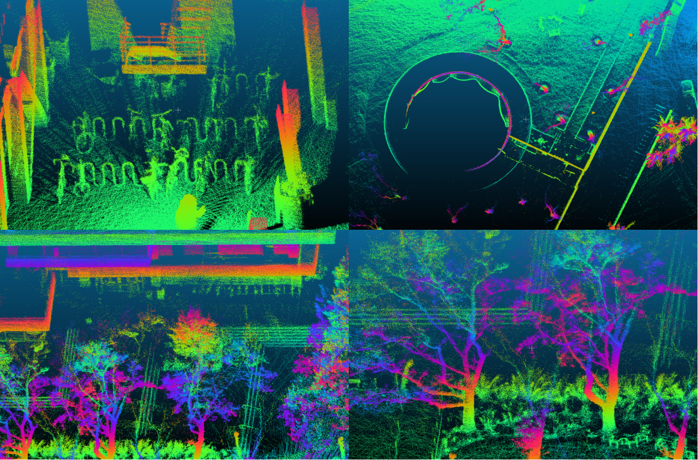

# MSF_LOAM [](https://github.com/kekeliu-whu/MSF_LOAM/actions/workflows/ci.yml)

[toc]

## Multi-Sensor Fusion SLAM

MSF_LOAM is a **M**ulti-**S**ensor **F**usion **SLAM** implementation based on [A-LOAM](https://github.com/HKUST-Aerial-Robotics/A-LOAM).



**Modifier** [Keke Liu](rickyrickc132@gmail.com)  
**Paper** [arxiv](https://arxiv.org/pdf/2209.12249.pdf)

## 1. Prerequisites
### 1.1 **Ubuntu** and **ROS**
Recommend: Ubuntu 20.04 and [ROS Noetic](http://wiki.ros.org/ROS/Installation).

### 1.2. Dependencies
**Ceres Solver**
```shell
sudo apt install libceres-dev
```
**PCL**
```shell
sudo apt install libpcl-dev
```
**fmt**
```shell
sudo apt install libfmt-dev
```

## 2. Build MSF_LOAM
Clone the repository and catkin_make.

## 3. Run

### 3.1 Datasets
TODO

### 3.2 Velodyne VLP-16 Example

Download [NSH indoor outdoor](https://drive.google.com/file/d/1s05tBQOLNEDDurlg48KiUWxCp-YqYyGH/view) to YOUR_DATASET_FOLDER. 

```bash
roslaunch msf_loam_velodyne msf_loam_velodyne_VLP_16.launch
rosbag play ${YOUR_DATASET_FOLDER}/nsh_indoor_outdoor.bag
```

### 3.3 Use self-collected data

| Sensor               | ROS topic        | Frequency | Remark                                                       |
| -------------------- | ---------------- | --------- | ------------------------------------------------------------ |
| LiDAR (**Required**) | /velodyne_points | 10        |                                                              |
| GPS                  | /odometry_gt     | 1         |                                                              |
| IMU                  | /imu             | 400       | higher frequency is better, use [xsens_ros_mti_driver](https://github.com/kekliu/xsens_ros_mti_driver) to record IMU data with high time precision |
> **ATTENTION** /velodyne_points must satisfy either of the following requirements:  
>> a. The field 'time' exists by using latest velodyne ROS driver;  
>> b. Ring increases with vertical angle and ring points are organized in CW order.

## 4. Acknowledgements

Thanks for LOAM (J. Zhang and S. Singh. LOAM: Lidar Odometry and Mapping in Real-time) and [A-LOAM](https://github.com/HKUST-Aerial-Robotics/A-LOAM).

## 5. Features
### DONE
* Graph based LiDAR-GPS fusion
* LiDAR-IMU tightly-coupled localization, step1
* LiDAR-IMU extrinsic parameter estimation

### TODO
* LiDAR-IMU tightly-coupled localization, step2
* Loop closure by [scancontext](https://github.com/irapkaist/scancontext)
* Online temporal calibration for system

## 6. Related paper

* Qin, T., Li, P. and Shen, S., 2018. Vins-mono: A robust and versatile monocular visual-inertial state estimator. *IEEE Transactions on Robotics*, *34*(4), pp.1004-1020.
* Qin, T. and Shen, S., 2018, October. Online temporal calibration for monocular visual-inertial systems. In *2018 IEEE/RSJ International Conference on Intelligent Robots and Systems (IROS)* (pp. 3662-3669). IEEE.
* Wu, Y., 2019. Formula Derivation and Analysis of the VINS-Mono. arXiv preprint arXiv:1912.11986.
